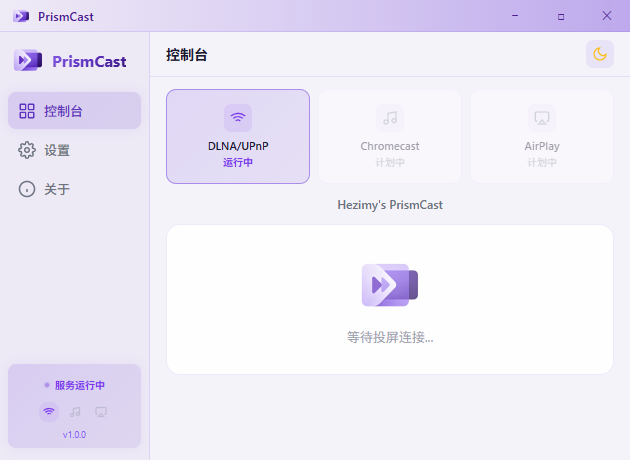

# PrismCast

[](LICENSE)

**PrismCast** 是一款现代化的 PC 媒体投屏接收端（当前版本在 Windows 上实现 DLNA/UPnP）。
将手机、平板或电脑上的音视频、图片无线投放到本机播放，自带托盘驻留与现代化设置界面。

**仓库**：https://github.com/hezimy/PrismCast

> 语言：简体中文 UI · 英文 UI 可选  
> 平台：**Windows 10/11**（需 WebView2；其他平台代码结构预留，尚未完整支持）

---

## 特性

- **DLNA MediaRenderer** — 自研 SSDP + SOAP + HTTP 协议栈，兼容常见投屏 App
- **多级播放回退** — MPV（推荐）→ 系统关联播放器 → 内置浏览器（含 HLS 代理）
- **MPV JSON IPC** — 播放/暂停/进度/音量步进控制
- **图片策略可配** — 系统查看器优先或 MPV 优先
- **系统托盘** — 启动后隐藏主窗口，托盘启停服务、显示/隐藏界面
- **无边框 UI** — 自定义标题栏，深/浅色主题，中/英双语
- **三档日志** — 主要 / 详细 / 关闭，UTF-8 编码，设置页一键打开日志目录
- **单实例** — 重复启动激活已有窗口，托盘仅一个图标
- **轻量常驻** — 空载约 30–40 MB（含 WebView2 运行时映射）

## 截图



## 快速开始

### 环境要求

| 依赖 | 版本 | 必需 |
|------|------|------|
| Go | 1.24+ | 构建时 |
| Node.js | 18+ | 构建时 |
| [Wails CLI](https://wails.io/docs/gettingstarted/installation) | v2 | 构建时 |
| [WebView2 Runtime](https://developer.microsoft.com/microsoft-edge/webview2/) |  Evergreen | 运行时 |
| [mpv](https://mpv.io/) | 任意近期版本 | 可选（推荐） |

### 开发

```powershell
git clone https://github.com/hezimy/PrismCast.git
cd PrismCast/prismcast
go mod tidy
cd frontend; npm install; cd ..
wails dev
```

### 发布构建

```powershell
cd PrismCast/prismcast
wails build -platform windows/amd64
```

产物：`prismcast/build/bin/PrismCast.exe`

> 请使用 `wails build` 发布，不要仅用 `go build`，否则 Windows 图标与嵌入资源可能不完整。

### 使用

1. 运行 `PrismCast.exe`（首次建议管理员方式运行，自动设置防火墙端口。可在设置中修改设备名、主题等）
2. 在控制台启动 **DLNA/UPnP** 服务
3. 手机同一 Wi‑Fi 下搜索投屏设备，选择 PrismCast
4. 未安装 MPV 时，部分 HLS/流媒体会通过本地浏览器页面播放

## 项目结构

```
.
├── LICENSE                    # Apache-2.0
├── THIRD_PARTY_NOTICES.md     # 第三方组件与商标说明
├── CHANGELOG.md               # 版本变更记录
├── gen_ico/                   # 从 PNG 生成 Windows .ico 的小工具
├── docs/                      # 设计/计划文档（可选阅读）
└── prismcast/                 # 主程序源码
    ├── main.go                # Wails 入口、托盘、单实例
    ├── wails.json
    ├── internal/
    │   ├── config/            # 配置持久化、开机自启
    │   ├── dlna/              # DLNA 服务、SSDP、浏览器 HLS 页
    │   ├── player/            # MPV、系统播放器、快捷键注入
    │   └── applog/            # 日志
    ├── frontend/              # Vue 3 + Vite 前端
    ├── third_party/hls.js/    # hls.js 许可证副本
    └── build/windows/         # 图标、manifest
```

## 配置

配置文件：`%APPDATA%\PrismCast\config.json`

| 项 | 说明 |
|----|------|
| `device_name` | DLNA 设备显示名 |
| `auto_start` | Windows 开机自启 |
| `image_viewer_first` | 图片优先系统查看器 |
| `log_level` | 日志档位：`main`（主要）/ `verbose`（详细）/ `off`（关闭） |
| `language` | `zh-CN` / `en-US` |
| `theme` | `dark` / `light` |

日志文件：`%TEMP%\PrismCast\prismcast.log`（UTF-8，新建时带 BOM，便于 Windows 记事本打开）

## 架构概览

```
┌─────────────────────────────────────────────┐
│  Vue 3 前端（控制台 / 设置 / 关于）            │
│         ↕ Wails JS Binding                   │
├─────────────────────────────────────────────┤
│  Go 后端                                     │
│  ├─ App：窗口、托盘、配置、单实例              │
│  ├─ DLNA Server：8765 端口，SSDP + SOAP       │
│  └─ Player：MPV IPC → 系统播放器 → 浏览器     │
└─────────────────────────────────────────────┘
         ↑ Wi‑Fi 局域网          ↓
    手机 / 平板投屏客户端      mpv / 系统播放器 / 系统浏览器
```

## 协议支持

| 协议 | 状态 |
|------|------|
| DLNA / UPnP (MediaRenderer) | ✅ 已实现 |
| Chromecast | ❌ 未实现 |
| AirPlay | ❌ 未实现 |
| Miracast | ❌ 需系统原生支持 |

## 开源与许可证

- **PrismCast 源码**：[Apache License 2.0](LICENSE)（Apache-2.0）
- **第三方组件**：见 [THIRD_PARTY_NOTICES.md](THIRD_PARTY_NOTICES.md)

### 关于 Apache-2.0 与侵权

在以下前提下，以 Apache-2.0 在 GitHub 开源：

1. **自有代码** — 本仓库 DLNA 协议栈与业务逻辑为项目自研，未复制他人受版权保护的源码。
2. **依赖许可证** — Wails、Vue、gorilla/mux、hls.js 等均为宽松开源许可证；保留 `THIRD_PARTY_NOTICES.md` 中的署名即可（已提供）。
3. **外部程序** — mpv、WebView2 由用户或系统另行安装，不随仓库捆绑其二进制。
4. **商标** — 可实现 DLNA/UPnP **兼容**能力；DLNA 为第三方商标。
5. **品牌资产** — Logo/图标为项目自有资产，随 Apache-2.0 一并发布。

他人可基于本项目做专有闭源衍生产品，但**须保留版权声明、许可证副本及变更说明**（见 LICENSE 第 4 节）。

> **免责声明**：以上为一般性说明，不构成法律意见。若涉及公司主体、商标或商业发布，建议咨询专业律师。

### 贡献

欢迎 Issue 与 Pull Request。提交 PR 即表示你同意在 Apache-2.0 下授权你的贡献。

## 赞助支持

如果本项目对你有帮助，欢迎请作者喝杯咖啡 ☕


## 相关链接

- 问题反馈：[GitHub Issues](https://github.com/hezimy/PrismCast/issues)
- 变更记录：[CHANGELOG.md](CHANGELOG.md)

---

Copyright © 2025–2026 PrismCast Contributors · [Apache-2.0](LICENSE)
